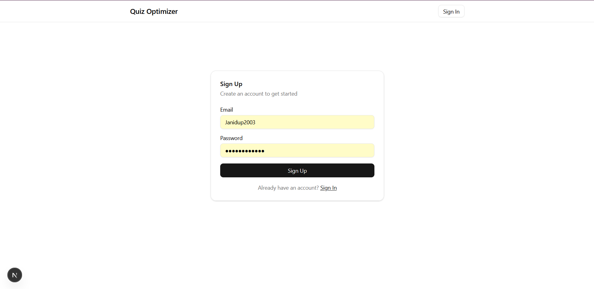
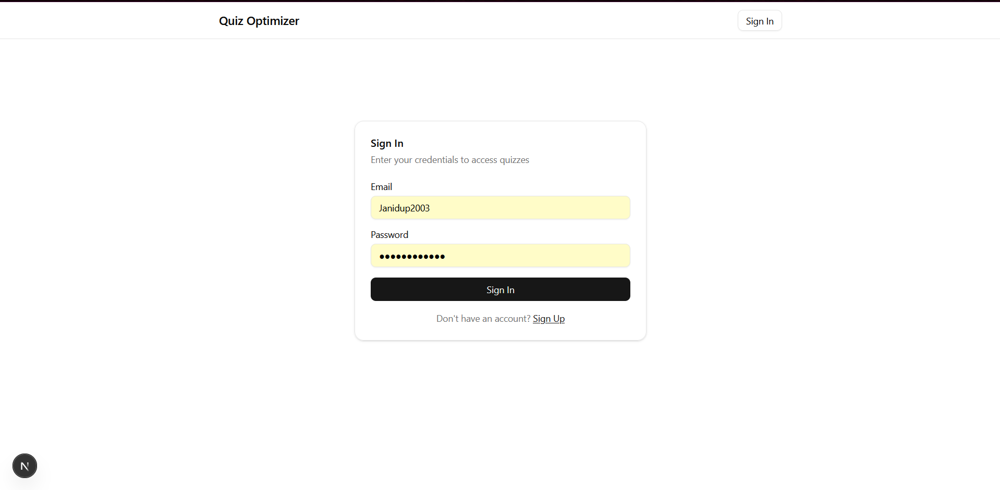
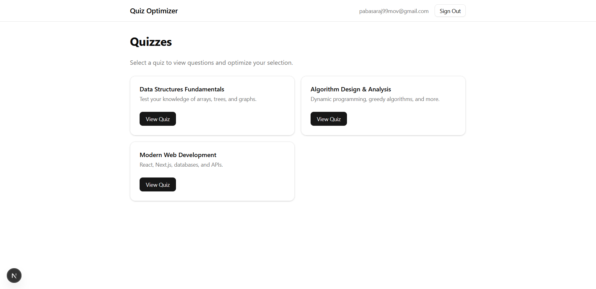
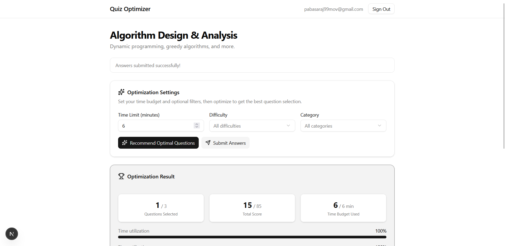
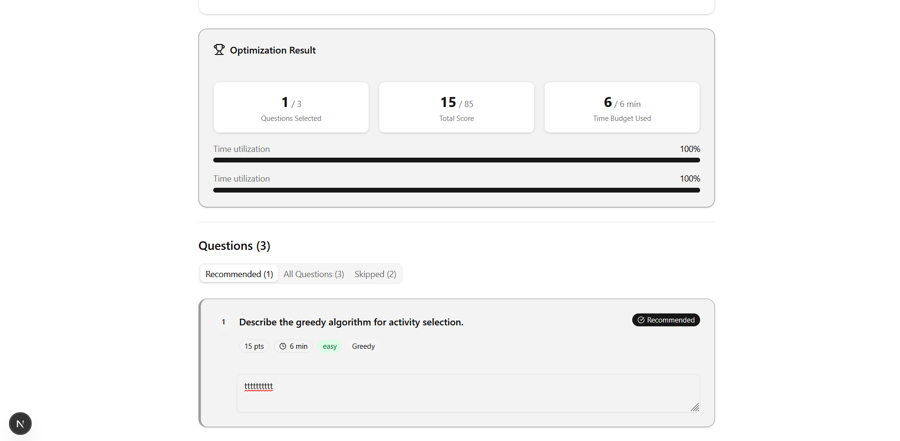
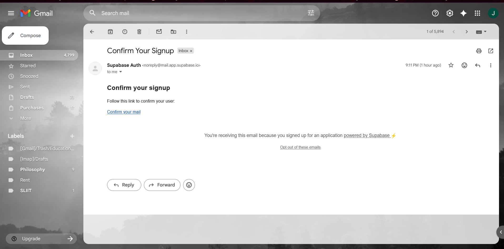
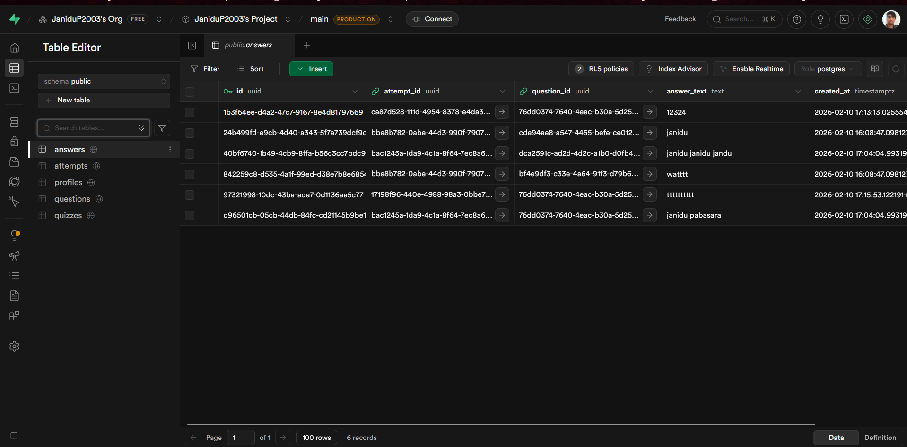
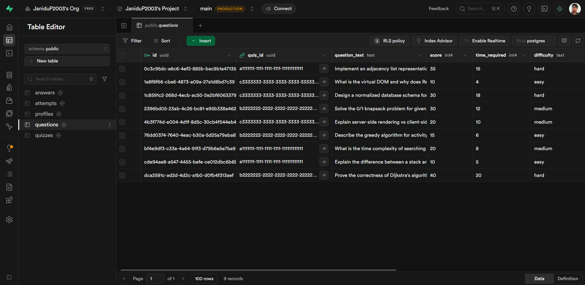

# Quiz Optimization App

A web application where users attempt quizzes and get **optimal question recommendations** using the **0/1 Knapsack dynamic programming algorithm**. Given a time budget, the app selects the subset of questions that maximizes total score.

## App Screens

| | |
|---|---|
|  |  |
|  |  |
|  |  |
|  |  |

## Tech Stack

- **Next.js 16** (App Router) with TypeScript
- **Supabase** (PostgreSQL database + Auth + RLS)
- **@supabase/ssr** for server/client Supabase clients
- **shadcn/ui** + Tailwind CSS v4 for UI components
- **Zod** for input validation
- **0/1 Knapsack DP** for question optimization

## Setup Instructions

### 1. Create a Supabase Project

1. Go to [supabase.com](https://supabase.com) and create a new project.
2. Note your **Project URL** and **anon public key** from Settings > API.

### 2. Run the Database Schema

In the Supabase SQL Editor, run the contents of:

```
supabase/schema.sql
```

This creates all tables (`profiles`, `quizzes`, `questions`, `attempts`, `answers`), constraints, indexes, RLS policies, and the auto-profile trigger.

### 3. Seed the Database

Run the contents of:

```
supabase/seed.sql
```

This inserts 3 sample quizzes with 9 questions total.

### 4. Configure Environment Variables

Copy the example env file and fill in your Supabase credentials:

```bash
cp .env.local.example .env.local
```

Edit `.env.local`:

```
NEXT_PUBLIC_SUPABASE_URL=https://your-project.supabase.co
NEXT_PUBLIC_SUPABASE_ANON_KEY=your-anon-key-here
```

### 5. Install & Run

```bash
npm install
npm run dev
```

Open [http://localhost:3000](http://localhost:3000).

---

## API Documentation

All API routes return JSON. Error responses use the shape `{ "error": "message", "details?": ... }`.

### GET `/api/quizzes`

Returns all quizzes.

**Response:** `Quiz[]`

```bash
curl http://localhost:3000/api/quizzes
```

### GET `/api/quizzes/[quizId]/questions`

Returns all questions for a quiz.

**Response:** `Question[]`

```bash
curl http://localhost:3000/api/quizzes/a1111111-1111-1111-1111-111111111111/questions
```

### POST `/api/quizzes/[quizId]/attempts` (Auth required)

Creates a new attempt.

**Body:**
```json
{ "totalTimeLimit": 30 }
```

**Response:** `{ "attemptId": "uuid" }` (201)

### POST `/api/attempts/[attemptId]/answers` (Auth required)

Submits/upserts answers for an attempt.

**Body:**
```json
{
  "answers": [
    { "questionId": "uuid", "answerText": "My answer" }
  ]
}
```

**Response:** `{ "success": true }` (201)

### POST `/api/quizzes/[quizId]/optimize` (Auth required)

Runs the 0/1 Knapsack DP algorithm to find the optimal subset of questions.

**Body:**
```json
{
  "totalTimeLimit": 20,
  "filters": {
    "difficulty": "medium",
    "category": "Trees"
  }
}
```

**Response:**
```json
{
  "selectedQuestionIds": ["uuid1", "uuid2"],
  "selectedQuestions": [...],
  "totalScore": 50,
  "totalTimeUsed": 18
}
```

### Status Codes

| Code | Meaning |
|------|---------|
| 200  | Success |
| 201  | Created |
| 400  | Invalid input (Zod validation failed) |
| 401  | Unauthenticated |
| 404  | Resource not found |
| 500  | Server error |

---

## DP Algorithm Explanation

### Problem Mapping: Quiz to 0/1 Knapsack

| Knapsack Concept | Quiz Concept |
|-------------------|--------------|
| Items | Questions |
| Weight | `time_required` |
| Value | `score` |
| Capacity | `totalTimeLimit` |

**Goal:** Select a subset of questions that **maximizes total score** without exceeding the time limit.

### Algorithm (in `src/lib/optimizeQuestions.ts`)

1. **Build DP table:** `dp[i][t]` = max score achievable using the first `i` questions with time capacity `t`.
2. **Recurrence:**
   - Don't take question `i`: `dp[i][t] = dp[i-1][t]`
   - Take question `i` (if `time_required <= t`): `dp[i][t] = max(dp[i][t], dp[i-1][t - time_required] + score)`
3. **Track decisions:** `keep[i][t] = true` if we chose to include question `i` at capacity `t`.
4. **Reconstruct:** Walk backwards from `dp[n][T]` using the `keep` table to identify which questions were selected.

### Complexity

- **Time:** O(n * T) where n = number of questions, T = time limit
- **Space:** O(n * T) for the DP and keep tables

### Edge Cases Handled

- Empty question list returns empty result
- Time limit 0 returns empty result
- Questions with `time_required > totalTimeLimit` are automatically excluded by DP

---

## Database Design

### Tables

- **profiles:** Mirrors `auth.users`. Auto-created via trigger on signup.
- **quizzes:** Quiz metadata (title, description).
- **questions:** Each belongs to a quiz. Has `score`, `time_required`, `difficulty`, `category`.
- **attempts:** Records a user's quiz attempt with their chosen time limit.
- **answers:** Records individual answers. Unique constraint on `(attempt_id, question_id)` prevents duplicate answers.

### Why the `attempts` table?

Separates the "session" (attempt) from individual answers. A user can attempt the same quiz multiple times with different time limits. Each attempt is a distinct record linked to answers.

### Constraints

- `score >= 0` — no negative scores
- `time_required > 0` — every question takes some time
- `total_time_limit > 0` — must have a positive time budget
- `UNIQUE(attempt_id, question_id)` — one answer per question per attempt

### Row Level Security (RLS)

- **profiles:** Users can only read/insert/update their own row.
- **quizzes / questions:** Publicly readable (SELECT policy = `true`).
- **attempts:** Users can only insert/select their own attempts (`user_id = auth.uid()`).
- **answers:** Users can only insert/select answers belonging to their own attempts (join check on `attempts.user_id`).

---

## Testing Instructions

### Manual Testing Steps

1. **Sign Up:** Go to `/login`, switch to Sign Up, create an account.
2. **Browse Quizzes:** Navigate to `/quizzes` to see the 3 seeded quizzes.
3. **View Quiz:** Click a quiz to see its questions with scores and time requirements.
4. **Optimize:** Set a time limit (e.g., 20 minutes), click "Recommend Optimal Questions." Verify recommended questions are highlighted and totals are shown.
5. **Filter & Optimize:** Try filtering by difficulty or category, then optimize again.
6. **Submit Answers:** Type answers for some questions, click "Submit Answers." Verify success message.
7. **Auth Protection:** Open an incognito window, try to access `/quizzes/[quizId]` — should redirect to `/login`.
8. **API Validation:** Send a POST to `/api/quizzes/[quizId]/optimize` with `totalTimeLimit: -1` — should return 400.

---

## Project Structure

```
quizz-optimization-app/
├── src/
│   ├── app/
│   │   ├── layout.tsx              # Root layout with Navbar
│   │   ├── page.tsx                # Redirects to /quizzes
│   │   ├── globals.css             # Tailwind + shadcn CSS
│   │   ├── login/
│   │   │   └── page.tsx            # Sign in / Sign up
│   │   ├── quizzes/
│   │   │   ├── page.tsx            # Quiz listing (server component)
│   │   │   └── [quizId]/
│   │   │       └── page.tsx        # Quiz detail (auth-protected)
│   │   └── api/
│   │       ├── quizzes/
│   │       │   ├── route.ts        # GET /api/quizzes
│   │       │   └── [quizId]/
│   │       │       ├── questions/
│   │       │       │   └── route.ts  # GET questions
│   │       │       ├── attempts/
│   │       │       │   └── route.ts  # POST create attempt
│   │       │       └── optimize/
│   │       │           └── route.ts  # POST optimize (DP)
│   │       └── attempts/
│   │           └── [attemptId]/
│   │               └── answers/
│   │                   └── route.ts  # POST submit answers
│   ├── components/
│   │   ├── ui/                     # shadcn/ui components
│   │   ├── navbar.tsx              # Navigation bar
│   │   └── quiz-detail.tsx         # Quiz interaction client component
│   ├── lib/
│   │   ├── utils.ts                # shadcn utils
│   │   ├── types.ts                # TypeScript interfaces
│   │   ├── validations.ts          # Zod schemas
│   │   ├── optimizeQuestions.ts    # 0/1 Knapsack DP algorithm
│   │   └── supabase/
│   │       ├── server.ts           # Server-side Supabase client
│   │       └── client.ts           # Browser-side Supabase client
│   └── middleware.ts               # Auth session refresh middleware
├── supabase/
│   ├── schema.sql                  # Database schema + RLS
│   └── seed.sql                    # Sample data
├── .env.local.example              # Environment variable template
└── package.json
```
